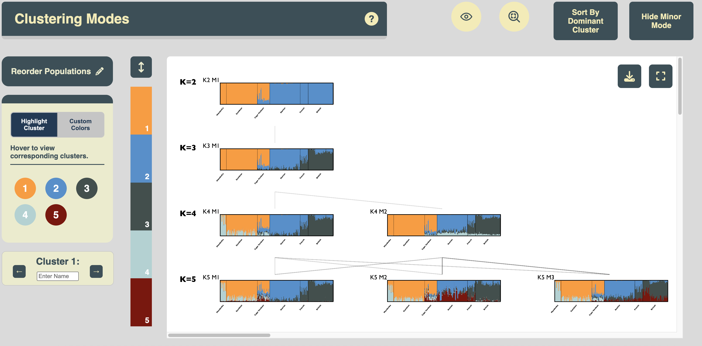

# *KAlignedoscope*: An interactive visualization tool for aligned clustering results from population structures analyses
-Powered by JavaScript D3-

***KAlignedoscope*** provides interactive visualizations for **aligned clustering results from population structure analysis** (e.g., [*Structure*](https://web.stanford.edu/group/pritchardlab/structure.html), [*ADMIXTURE*](https://github.com/NovembreLab/admixture), [*fastStructure*](https://rajanil.github.io/fastStructure)) that are aligned by **clustering alignment** methods (e.g., [*Clumppling*](https://github.com/PopGenClustering/Clumppling), [*Pong*](https://github.com/ramachandran-lab/pong)).

> 💡 **Note:** 
> Check out [this tutorial](https://github.com/PopGenClustering/popstru-cls-align-vis-workflow) for a comprehensive workflow of performing and consolidating (clustering-based) population structure analysis, including performing *ADMIXTURE*, *Structure*, and *fastStructure* analysis, aligning clustering results using *Clumppling*, and visualizing the aligned results interactively using *KAlignedoscope*.


## Example interface
<p align="center">

</p>

## Terminologies and summary of features
Here are some terminologies we use throughout this guide:
* Membership matrix: The clustering output matrix ($N$ rows by $K$ columns) for $N$ individuals and $K$ clusters. Each row represents an individual's memberships in all clusters, with row entries summing up to one. 
* Clustering mode: Distinct clustering solutions that are representative of all clustering runs.
  * major mode: The clustering mode which the largerst number of clustering runs align to.
  * minor mode: The clustering mode which fewer clustering runs align to.
* Structure plot: Visualization of the membership matrix in stacked bar charts. Each individual corresponds to a column in the plot, with its fraction memberships in clusters represented by stacked bars with distinct colors.
* Population label: The labels pre-assigned to individuals. In population genetics data, this is usually the population that each individual is sampled from, e.g., ``GBR`` for British and ``PUR`` for "Puerto Rican in Puerto Rico" in 1000 Genomes Project data.

***KAlignedoscope*** aims to support user-interactivity and friendliness with aesthetic interface. Some important features include:
1. Reordering:
   * (if population label is provided for each individual) reorder population
   * reorder individuals by dominant cluster in a population
   * reorder clusters (update its vertical stacking order in the structure plot)
2. Highlight a cluster
3. Display of alignment quality between cluster modes with different K
4. Display of information of specific component through hovering tooltips.
5. Other customizable features: cluster name relabeling, cluster color picking, and title renaming. 

## Installation
### Check *Python* and dependencies
See [the tutorial of *Clummppling*](https://github.com/PopGenClustering/Clumppling) on how to install Python, if needed.

***KAlignedoscope*** has minimal package dependicy requirement, all are Python's default (Standard Library) packages. In addition, it requires the `pandas` package, which should be installed upon the installation of *KAlignedoscope*; if it is not, install it via
````
pip install pandas
````

### Install *KAlignedoscope* (v0.1.10)

Run
````
pip install kalignedoscope
````
to install the tool. To check if the tool has been successfully installed, run
````
python -m kalignedoscope -h
````
which will prompt the user with the following helper messages:
````bash
usage: __main__.py [-h] [--input INPUT] [--label_file LABEL_FILE] --processed_membership PROCESSED_MEMBERSHIP [--alignment_file ALIGNMENT_FILE]

KAlignedoscope: A tool for clustering and mapping genomic data.

options:
  -h, --help            show this help message and exit
  --input INPUT, -i INPUT
                        Input folder with .Q files
  --label_file LABEL_FILE
                        Optional file with individual labels (to be added as the second column in intermediate files).
  --processed_membership PROCESSED_MEMBERSHIP
                        Path to store intermediate files containing the clustering results.
  --alignment_file ALIGNMENT_FILE
                        Input file containing the cluster alignment.
````

## Run *KAlignedoscope* on example datasets

We provide two example datasets to demonstrate the usage of our interactive visualization tool. Both are available under [``/Data``](/Data).

### Cape Verde data

We provide the clustering alignment results generated by *Clumppling*'s alignment of *ADMIXTURE* runs on the Cape Verde dataset (with 399 individuals). This dataset was used in the demonstration of [*Clumppling*](https://github.com/PopGenClustering/Clumppling).
See [the tutorial of *Clummppling*](https://github.com/PopGenClustering/Clumppling) for a description of the dataset and how *Clumppling* was run on the clustering results. The input data to *KAlignedoscope* was taken directly from the output data of *Clumppling*.

Unzip the attached ``capeverde_clumppling_output.zip``  and also get the attached ``capeverde_ind_labels.txt`` file.

Then run *KAlignedoscope* by:
````bash
python -m kalignedoscope \ 
--input ${CLUMPPLING_OUTPUT_DIR}/modes_aligned \
--alignment_file ${CLUMPPLING_OUTPUT_DIR}/alignment_acrossK/alignment_acrossK_rep.txt \
--label_file PATH_TO/capeverde_ind_labels.txt \
--processed_membership YOUR_PATH_FOR_INTERMEDIATE_FILES 
````
where ``${CLUMPPLING_OUTPUT_DIR}`` is the directory of unzipped data. For ``YOUR_PATH_FOR_INTERMEDIATE_FILES``, choose whatever your prefer, for example, a ``files`` folder under your current working directory.

For example,
````
python -m kalignedoscope --input capeverde_clumppling_output/modes_aligned --alignment_file capeverde_clumppling_output/alignment_acrossK/alignment_acrossK_rep.txt --label_file capeverde_ind_labels.txt --processed_membership intermediate_files
````

If you have your browser open, a window will pop up automatically. If not, a ``visualization.html`` will be generated in your working directory, and you may instead open it manually from there.

### 1000 Genome Project data
We also provide the clustering alignment results, generated by *Clumppling*'s alignment of *ADMIXTURE* runs on the 1000 Genome Project dataset (with 2426 individuals). This dataset was used in the demonstration of [*Pong*](https://github.com/ramachandran-lab/pong). We similarly reproduced the clusteirng alignment results using *Clumppling* and took the input data to *KAlignedoscope* directly from that.

Unzip the attached ``1kG-p3_clumppling_output.zip``. The population labels are provided alongside the clustering alignemnt results, thereby there is no need for additional population label file. 

Run *KAlignedoscope* by:
````bash
python -m kalignedoscope \ 
       --input ${CLUMPPLING_OUTPUT_DIR}/modes_aligned \
       --alignment_file ${CLUMPPLING_OUTPUT_DIR}/alignment_acrossK/alignment_acrossK_rep.txt \
       --label_file ${CLUMPPLING_OUTPUT_DIR}/input/ind_labels_grouped.txt \
       --processed_membership YOUR_PATH_FOR_INTERMEDIATE_FILES
````
where ``${CLUMPPLING_OUTPUT_DIR}`` is the directory of unzipped data.
