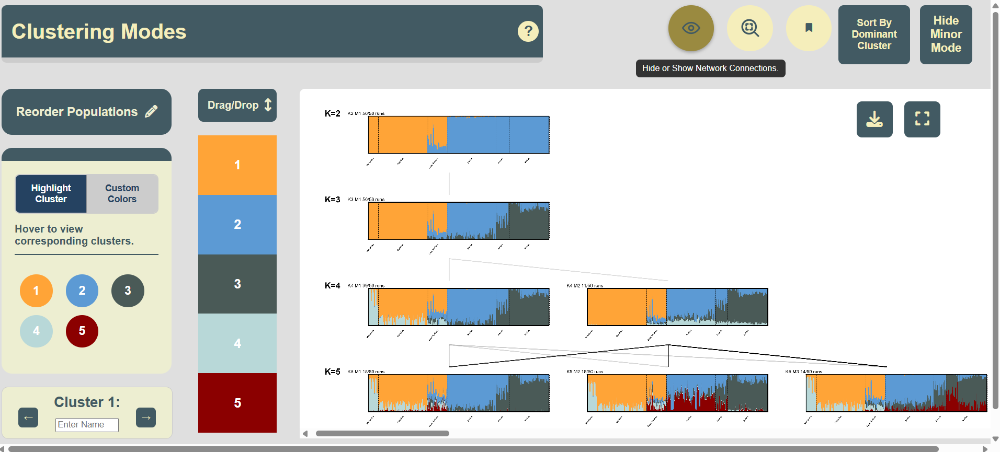
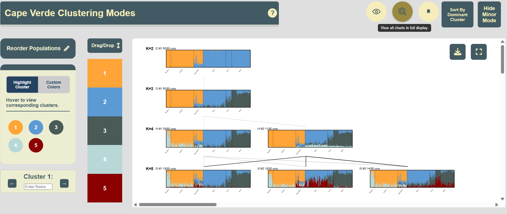
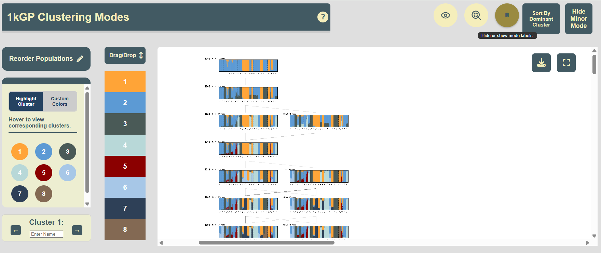
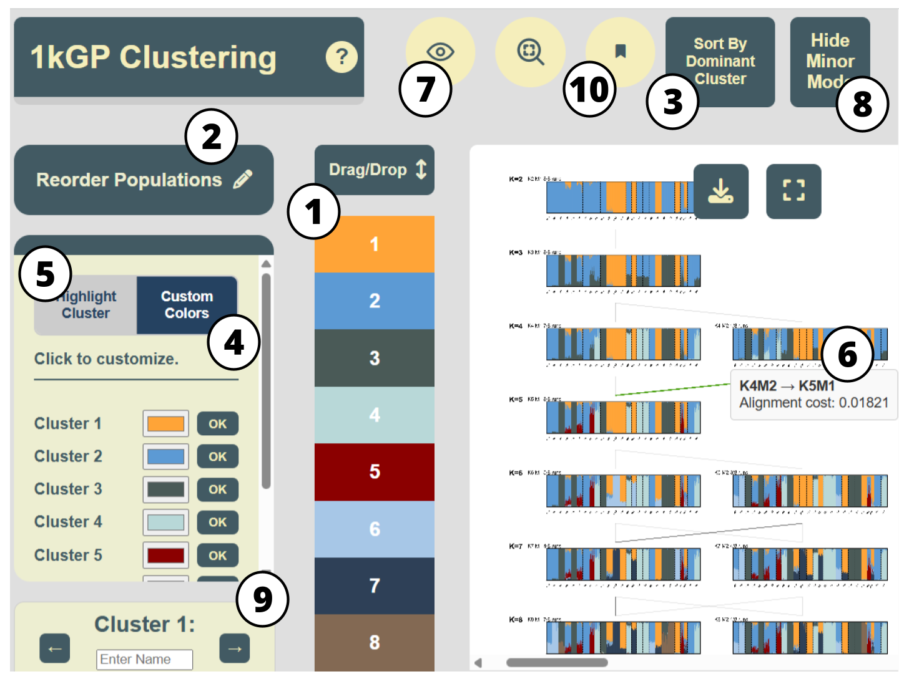

# *KAlignedoscope*: An interactive visualization tool for aligned clustering results from population structures analyses
(Last updated: Feb 2026)

-Powered by JavaScript D3-

***KAlignedoscope*** provides interactive visualizations for **aligned clustering results from population structure analysis** (e.g., [*Structure*](https://web.stanford.edu/group/pritchardlab/structure.html), [*ADMIXTURE*](https://github.com/NovembreLab/admixture), [*fastStructure*](https://rajanil.github.io/fastStructure)) that are aligned by **clustering alignment** methods (e.g., [*Clumppling*](https://github.com/PopGenClustering/Clumppling), [*Pong*](https://github.com/ramachandran-lab/pong)).

> 💡 **Note:** 
> Check out [this tutorial](https://github.com/PopGenClustering/popstru-cls-align-vis-workflow) for a comprehensive workflow of performing and consolidating (clustering-based) population structure analysis, including performing *ADMIXTURE*, *Structure*, and *fastStructure* analysis, aligning clustering results using *Clumppling*, and visualizing the aligned results interactively using *KAlignedoscope*.
### Outline of README
* Example Interface
* Terminologies and Features
* Installation of Python, KAlignedoscope, and other packages
* Running KAlignedoscope on Provided Examples
* Labeled Interface and Recommended Feature Combinations


## Example interface
<p align="center">

</p>

## Terminologies and summary of features
Here are some terminologies we use throughout this guide:
* Membership matrix: The clustering output matrix ($N$ rows by $K$ columns) for $N$ individuals and $K$ clusters. Each row represents an individual's memberships in all clusters, with row entries summing up to one. 
* Clustering mode: Distinct clustering solutions that are representative of all clustering runs.
  * Major mode: The clustering mode which the largerst number of clustering runs align to.
  * Minor mode: The clustering mode which fewer clustering runs align to.
* Structure plot: Visualization of the membership matrix in stacked bar charts. Each individual is organized on the x-axis and corresponds to a column in the plot. Each individual's column is made up of proportional membership to clusters represented by vertically stacked bars with distinct colors. 
* Population label: The labels pre-assigned to individuals, user-provided. In population genetics data, this is usually the population that each individual is sampled from, e.g., ``GBR`` for British and ``PUR`` for "Puerto Rican in Puerto Rico" in 1000 Genomes Project data.

***KAlignedoscope*** aims to support user-interactivity and friendliness with aesthetic interface. Some important features include:
1. Reordering:
   * (If population label is provided for each individual) Reorder population.
   * Reorder individuals by dominant cluster in a population.
   * Reorder clusters (update its vertical stacking order in the structure plot).
2. Highlight a cluster simultaneuously across all charts, by clicking or hovering.
4. Display of alignment quality between cluster modes with different K.
5. Display of information of specific component through hovering tooltips.
6. Other customizable features: cluster name relabeling, cluster color picking, and title renaming. 

## Installation
### Check *Python* and dependencies
If not already installed, download the Python installer accordingly from https://www.python.org/downloads/ 
* Download the latest Python release for Windows machines at https://www.python.org/downloads/windows/ or for macOS at https://www.python.org/downloads/macos/
Verify the installation in your command line via 
````
python --version
````
See [the tutorial of *Clummppling*](https://github.com/PopGenClustering/Clumppling) on how to install Python, if needed.

***KAlignedoscope*** has minimal package dependicy requirement, all are Python's default (Standard Library) packages. In addition, it requires the `pandas` package, which should be installed upon the installation of *KAlignedoscope*; if it is not, install it via
````
pip install pandas
````

### Install *KAlignedoscope* (v0.2)

Run
````
pip install kalignedoscope
````
to install the tool. To check if the tool has been successfully installed, run
````
python -m kalignedoscope -h
````
which will prompt the user with the following helper messages:
````bash
usage: __main__.py [-h] [--input INPUT] [--label_file LABEL_FILE] --processed_membership PROCESSED_MEMBERSHIP
                   [--alignment_file ALIGNMENT_FILE] [--alignment_perK_file ALIGNMENT_PERK_FILE]
                   [--alignment_acrossK_file ALIGNMENT_ACROSSK_FILE] [--mode_stats MODE_STATS]
                   [--input_tool {clumppling,pong}]

KAlignedoscope: A tool for clustering and mapping genomic data.

options:
  -h, --help            show this help message and exit
  --input INPUT, -i INPUT
                        Input folder with .Q files
  --label_file LABEL_FILE
                        Optional file with individual labels to add as the second column
  --processed_membership PROCESSED_MEMBERSHIP
                        Input folder containing the clustering result files.
  --alignment_file ALIGNMENT_FILE
                        Input file containing the cluster alignment (from Clumppling).
  --mode_stats MODE_STATS
                        Input file containing mode statistics (Mode, Representative, Size, Cost, Performance).  
  --input_tool {clumppling,pong}
                        Tool that generated the input files.
````

## Run *KAlignedoscope* on example datasets

We provide two example datasets to demonstrate the usage of our interactive visualization tool. Both are available under [``/Data``](/Data).

### Cape Verde data

We provide the clustering alignment results generated by *Clumppling*'s alignment of *ADMIXTURE* runs on the Cape Verde dataset (with 399 individuals). This dataset was used in the demonstration of [*Clumppling*](https://github.com/PopGenClustering/Clumppling).
See [the tutorial of *Clummppling*](https://github.com/PopGenClustering/Clumppling) for a description of the dataset and how *Clumppling* was run on the clustering results. The input data to *KAlignedoscope* was taken directly from the output data of *Clumppling*.

Unzip the attached ``capeverde_clumppling_output.zip``  and also get the attached ``capeverde_ind_labels.txt`` file.

Then run *KAlignedoscope* by:
````bash
python -m kalignedoscope \ 
--input ${CLUMPPLING_OUTPUT_DIR}/modes_aligned \
--alignment_file ${CLUMPPLING_OUTPUT_DIR}/alignment_acrossK/alignment_acrossK_rep.txt \
--label_file PATH_TO/capeverde_ind_labels.txt \
--mode_stats ${CLUMPPLING_OUTPUT_DIR}/modes/mode_stats.txt \
--processed_membership YOUR_PATH_FOR_INTERMEDIATE_FILES 
````
where ``${CLUMPPLING_OUTPUT_DIR}`` is the directory of unzipped data. For ``YOUR_PATH_FOR_INTERMEDIATE_FILES``, choose whatever your prefer, for example, a ``files`` folder under your current working directory. If it does not run, you can consider putting your paths in quotation marks, or changing the direction of the slashes. 

For example,
````
python -m kalignedoscope --input capeverde_clumppling_output/modes_aligned --alignment_file capeverde_clumppling_output/alignment_acrossK/alignment_acrossK_rep.txt --label_file capeverde_ind_labels.txt --processed_membership intermediate_files --mode_stats capeverde_clumppling_output/modes/mode_stats.txt
````

If you have your browser open, a window will pop up automatically. If not, a ``visualization.html`` will be generated in your working directory, and you may instead open it manually from there.
#### Expected output 
The following output has been briefly resized with the magnifying button, currently hovered on in the figure below and located in top right row.


### 1000 Genome Project data
We also provide the clustering alignment results, generated by *Clumppling*'s alignment of *ADMIXTURE* runs on the 1000 Genome Project dataset (with 2426 individuals). This dataset was used in the demonstration of [*Pong*](https://github.com/ramachandran-lab/pong). Pong organizes the data into several K from K=2 to K=8, with varying modes. We similarly reproduced the clusteirng alignment results using *Clumppling* and took the input data to *KAlignedoscope* directly from that.

Unzip the attached ``1kG-p3_clumppling_output.zip``. The population labels are provided alongside the clustering alignemnt results, thereby there is no need for additional population label file. 

Run *KAlignedoscope* by:
````bash
python -m kalignedoscope \ 
       --input ${CLUMPPLING_OUTPUT_DIR}/modes_aligned \
       --alignment_file ${CLUMPPLING_OUTPUT_DIR}/alignment_acrossK/alignment_acrossK_rep.txt \
       --label_file ${CLUMPPLING_OUTPUT_DIR}/input/ind_labels_grouped.txt \
       --processed_membership YOUR_PATH_FOR_INTERMEDIATE_FILES \
       --mode_stats ${CLUMPPLING_OUTPUT_DIR}/modes/mode_stats.txt 
````
where ``${CLUMPPLING_OUTPUT_DIR}`` is the directory of unzipped data. 

#### Expected output
The following output has been briefly resized with the resize (magnifying) button located in top right row. We have also relabeled the title by clicking into in-line text on the top left title bar. 


## Navigating the tool 
The interface of Kalignedoscope is designed to be interactive and guided. Mousing over many of the labeled buttons, panels, and tabs, will provide pop-ups with short explanations of the button's usage. For specific features and where to find them, reference the map below. Also, clicking the information icon which has a question mark centered on a cirle on the top left title will be useful. 
<p align "middle">

</p>

|  #  | **Feature**                                                    | **Description**                                                                                                                                                                                                                                                                                                                  |
| :-: | -------------------------------------------------------------- | -------------------------------------------------------------------------------------------------------------------------------------------------------------------------------------------------------------------------------------------------------------------------------------------------------------------------------- |
|  1  | **Reorder Clusters** <br>*(drag and drop)*                     | A vertical legend on the left shows clusters in their current **stacking order**. The first cluster appears at the bottom of the structure plot, the second above it, and so on. Users can drag-and-drop cluster color blocks to reset a top-down order, which updates all plots with a quick re-render.                         |
|  2  | **Reorder Populations** <br>*(drag and drop)*                  | Clicking the **“Reorder Population”** button gives a drop-down list of populations in their current ordering. This feature is disabled if no population labels are provided. Users can move and reorder populations in the list. The updated order will be reflected in the x-axes of structure plots upon clicking **“Apply.”** |
|  3  | **Sort by Cluster Dominance** <br>*(button click & selection)* | Clicking **“Sort by Cluster Dominance”** activates sorting of individuals based on a user-selected structure plot (clustering mode). Within each population, individuals are sorted by descending membership in that population’s largest cluster. The same ordering is applied to all other modes.                              |
|  4  | **Customize Colors** <br>*(color picker)*                      | Users can assign new colors to clusters using the **Custom Colors** panel and apply them by clicking **“OK.”** By default, colors are drawn from a color-blind–friendly palette.                                                                                                                                                 |
|  5  | **Highlight a Cluster** <br>*(mouse-over or click)*            | Mousing over or clicking a cluster in the **Highlight Cluster** panel highlights it across all structure plots while dimming the others.                                                                                                                                                                                         |
|  6  | **Display Tooltip** <br>*(mouse-over)*                         | A tooltip appears when hovering over individuals or alignment edges, displaying details such as membership proportions or alignment cost.                                                                                                                                                                                        |
|  7  | **Show Alignment Edges** <br>*(button click)*                  | Clicking the **eye** button toggles the visibility of edges connecting aligned modes. Darker edges indicate better alignment.                                                                                                                                                                                                    |
|  8  | **Hide Minor Modes** <br>*(button click)*                      | By default, all aligned modes are shown. Clicking **“Hide Minor Mode”** hides less significant modes, displaying only the major ones.                                                                                                                                                                                            |
|  9  | **Rename Clusters** <br>*(toggle & inline edit)*               | In the bottom-left panel, users can rename clusters; changes are synced to tooltips on the legend and to individuals’ bars across all structure plots.                                                                                                                                                                           |
|  10  | **Show Mode Labels** <br>*(button click)*               | Clicking the bookmark button hides or shows the label of each mode, which includes the number of clusters, the mode name, and the number of clustering runs in the mode.  


### Useful combinations of features
Features on their own, such as Population Reordering, can save the user time in reordering populations manually in the spreadsheet. 
* Reordering populations by a particular cluster's spread, dominantly sorting, then highlighting that cluster to compare its shape across populations.
* Reordering populations by region, and picking colors for a population's clusters to correspond to another variable - somewhat like a manual heatmap.
* Manually greying out several clusters to highlight relevant ones - similar to the highlight feature, but for more layered groupings.
* Once patterns have been identified, it could be useful to merge groups within-K by assigning the same or similar colors. 

